   
  
   
   

<h3> Open source protocol for audio and video content streaming</h3>

 

## What is FCast?

FCast is an open source protocol that enables wireless streaming of audio and video content between devices, supporting various stream types such as DASH, HLS, and mp4.

Unlike proprietary protocols like Chromecast and AirPlay, FCast offers an open approach, empowering third-party developers to create their own receiver devices or integrate the FCast protocol into their own apps.

## Features

- Simple
- Open source protocol for audio and video content streaming
- Support for various stream types (DASH, HLS, mp4)
- Compatibility with Linux, Windows, MacOS, and Android
- mDNS for device discovery
- Extensive freedom for developers to create custom receivers

## Sender-Receiver Interaction in FCast

In FCast, a "sender" is a device or software application that discovers and communicates with a "receiver". The sender, which can be a terminal client or an Android application, uses the FCast protocol to send media content to the receiver, such as a TV or media top box. The sender initiates the media streaming by connecting to the receiver, launching the media, and then the receiver begins playing the media. Once the media is launched, the sender can control the playback, allowing operations like pause, resume, seek, and volume adjustment.

A "receiver", in this context, is a software implementation running on various platforms (Linux, Windows, MacOS, Android, ...) that receives media content from the sender. It continuously provides updates to the sender about the current state of playback.

## Project Structure

- Receivers
  - [**Android**](receivers/android) native.
  - [**MacOS, Windows, Linux**](receivers/electron) electron.
  - [**webOS**](receivers/webos)
  - [**Tizen**](receivers/tizen)

- Senders
  - [**Grayjay**](https://github.com/futo-org/grayjay-android) is a player that exposes multiple video websites as sources in the app.
  - [**Terminal**](https://github.com/futo-org/fcast/tree/master/senders/terminal) sender allows you use the FCast protocol over the command line interface.

## Contributing

We welcome all contributions. Please read our CONTRIBUTING.md before submitting any pull requests.

## License

This project is licensed under the MIT License - see the LICENSE.md file for details.

## Documentation

Click [here](https://gitlab.futo.org/videostreaming/fcast/-/wikis/Protocol-version-3) to see the protocol documentation.
