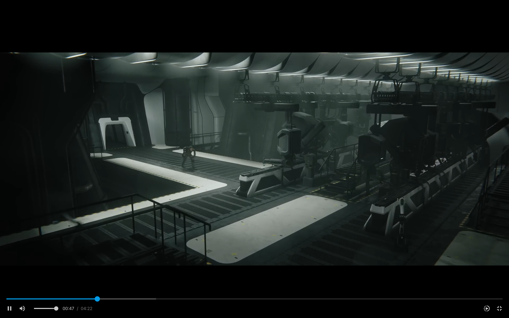
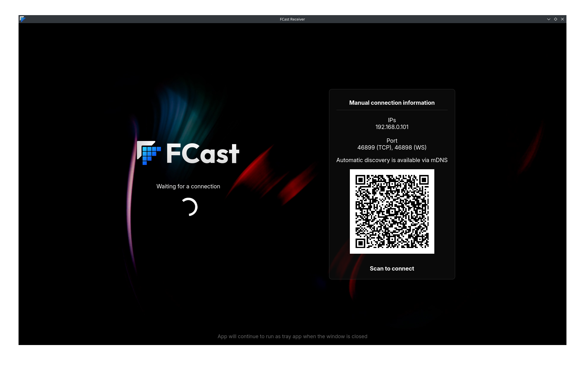

# What is FCast?

FCast is a protocol designed for wireless streaming of audio and video content between devices. Unlike alternative protocols like Chromecast and AirPlay, FCast is an open source protocol that allows for custom receiver implementations, enabling third-party developers to create their own receiver devices or integrate the FCast protocol into their own apps.

# Why do I need a receiver?

The FCast receiver is a working receiver implementation compatible with Linux, Windows and MacOS that supports various stream types such as DASH, HLS and mp4.



# Protocol specification

The protocol specification can be found here https://gitlab.futo.org/videostreaming/fcast/-/wikis/home

# Receiver application

1. Download the latest build for your platform from https://fcast.org/#downloads or build it yourself by following the build instructions.
2. Unzip the archive at your desired location.
3. Run the FCast receiver.
   - **MacOS:** Run the `FCast Receiver` application
   - **Linux:** Run the `fcast-receiver` application
   - **Windows:** Run the `fcast-receiver.exe` application
4. The application will open the main window where you can setup a connection to your sender device.



The application will continue to run in the system tray when you close the player or main window. You can exit the application or access other menu options from the tray icon.

There are also command line flags to customize application behavior, some of which include:
* `--no-main-window`: Hide the main window on start
* `--fullscreen`: Start the main window in fullscreen

Use the `--help` flag to see full list of available flags.

# Connecting to the FCast receiver with the video streaming application

## Automatic discovery

1. Open the video streaming application.
2. Open the FCast receiver or restart it.
3. The receiver should now be visible in the casting dialog under "Discovered Devices".
4. If this failed, try manually connecting it. Automatic discovery does not work on all network types.
5. Click start to connect to the device.
6. Start watching content.

## Manual

1. Open the FCast receiver.
2. Find the IP of the device running the receiver.
3. Open the video streaming application.
4. Open the casting dialog.
5. Click add to manually add a device.
6. Select the FCast protocol, enter a descriptive name, the IP you found and port 46899.
7. Click start to connect to the device.
8. Start watching content.


# How to build

## Preparing for build

A docker file is provided to setup your build environment. From the root of the repository:
* Build: `docker build -t fcast/receiver-electron-dev:latest receivers/electron/`
* Run: `docker run --rm -it -w /app/receivers/electron --entrypoint='bash' -v .:/app fcast/receiver-electron-dev:latest`

You can then run the following commands to finish setup.

```
npm install
```

## Development

Run the following commands in the `/app/receivers/electron` directory.
* Build: `npm run build`
* Run: `npm run start`

## Packaging

Below are the following platforms currently used for packaging:
* `npm run make -- --platform="darwin" --arch="arm64"`
* `npm run make -- --platform="darwin" --arch="x64"`
* `npm run make -- --platform="win32" --arch="x64"`
* `npm run make -- --platform="linux" --arch="x64"`
* `npm run make -- --platform="linux" --arch="arm64"`

Other platforms and architectures supported by [Electron Forge](https://www.electronforge.io/) might work, but are currently untested.

Packages that will be built from running the above `make` commands:
* Windows: `.msi` and `.zip`
* MacOS: `.dmg` and `.zip`
* Linux: `.deb`, `.rpm` and `.zip`

Package artifacts will be located in `/app/receivers/electron/out/make`
