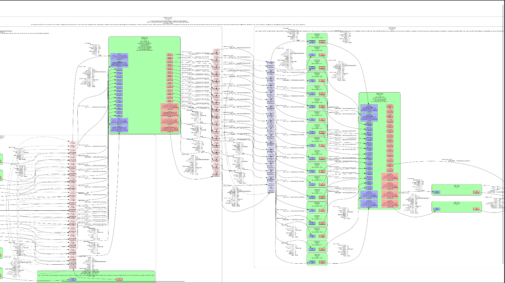

# Remote pipeline debugger

Show gstreamer pipelines of a remote client.

## Usage

`cargo r -r -p remote-pipeline-dbg` and execute the desktop receiver with the `PIPELINE_DBG_HOST` env variable set (default is localhost). For the android receiver simply set the env var when building the rust component.
